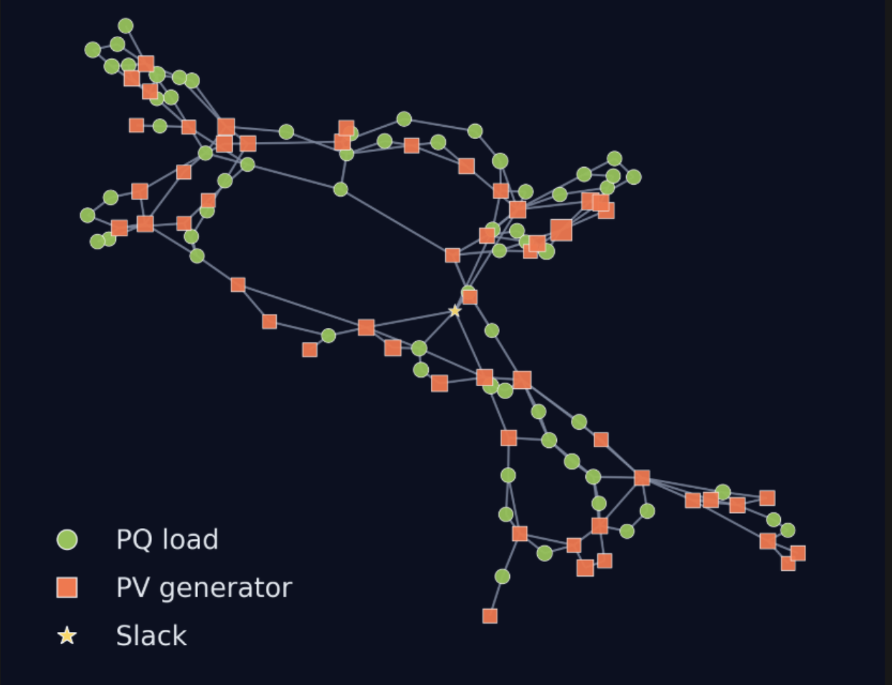

# Physics-Informed GNN for Optimal Power Flow

This project implements physics-informed graph neural networks (GNNs) to improve the accuracy and interpretability of optimal power flow solutions in electrical grids. 



## Overview

Optimal Power Flow (OPF) is the computational heart of the modern energy grid, balancing cost-efficiency with strict physical laws. While traditional iterative solvers (like Newton-Raphson) are precise, their high computational cost prohibits real-time adaptation for large-scale, renewable-heavy grids.

This repository implements HeGGA, a Physics-Aware Heterogeneous Graph Neural Network designed to approximate AC-OPF solutions in milliseconds. Unlike standard "black-box" GNNs, our architecture explicitly models the grid's heterogeneous naturen and enforces physical constraints directly in the learning process.

Key Innovations:

- Heterogeneous Encoders/Decoders: Distinct MLP heads for different node types allow the model to learn specific control policies for generators versus consumers.

- Local-Global Fusion: A hybrid interaction block that combines local impedance-based message passing (to satisfy Kirchhoff's laws) with global attention mechanisms (to capture grid-wide voltage stability).

- Physics-Informed Regularization: A custom loss function that penalizes power balance violations, ensuring predictions are not just accurate but physically realizable.

## Setup Instructions

1. Install `uv` if not already installed:

   ```bash
   pip install uv
   ```

2. Create a new virtual environment:

   ```bash
   python -m venv venv
   source venv/bin/activate  # On Windows use `venv\Scripts\activate`
   ```

3. Synchronize dependencies and install requirements:

   ```bash
   uv sync
   ```

4. You are now ready to run experiments.

## Dataset

The repository ships with the PowerGraph benchmark installed under `data/raw`.
Each dataset follows the `<dataset_name>/<dataset_name>/raw` layout from the original Figshare
release ([PowerGraph](https://figshare.com/articles/dataset/PowerGraph/22820534?file=50081700)).

Precise information about downloading and preparing the data can be found in the README.md of the data folder.

Commands to install:

```bash
cd data/raw
wget -O data.tar.gz "https://figshare.com/ndownloader/files/46619152"
tar -xf data.tar.gz
rm data.tar.gz
```
Or one can download the dataset "dataset_pf_opf.zip" from (https://figshare.com/articles/dataset/PowerGraph/22820534) and unzip it under `data/raw/`.

## Running an Experiment

To launch a training run with the default GraphSAGE configuration, use:

```bash
uv run src/experiments/run_experiment.py --config src/config/graphsage.yaml
```

This command starts training with physics-informed regularization enabled and logs results for analysis.

This command starts training with physics-informed regularization enabled and logs results for analysis.

## Reproducing the Medium results (HeGGA + ablations + baseline)

- Hardware: a GPU is required; expect roughly 1m30s per epoch on IEEE118 with an NVIDIA A5000. CPU training is not recommended for parity.
- Main HeGGA run: scripts/train_hnn.sh with config src/config/HeGGA_lappe.yaml. If the user wants to run an experiment without PE, set pe_dims: 0. Both mse and huber losses are supported via the config.
- Ablation (use only the final attention layer): scripts/train_hnn_ablation.sh with config src/config/hh_one_attention.yaml. Same hyperparameters; set pe_dims: 0 to disable positional encodings if desired.
- Transformer baseline: scripts/train_transformer.sh with config src/config/transformer_baseline.yaml

Keep the configuration values as default to match the reported metrics.

## Credits

- Yassine Guennoun
- Édouard Rabasse
- Hippolyte Wallaert  
